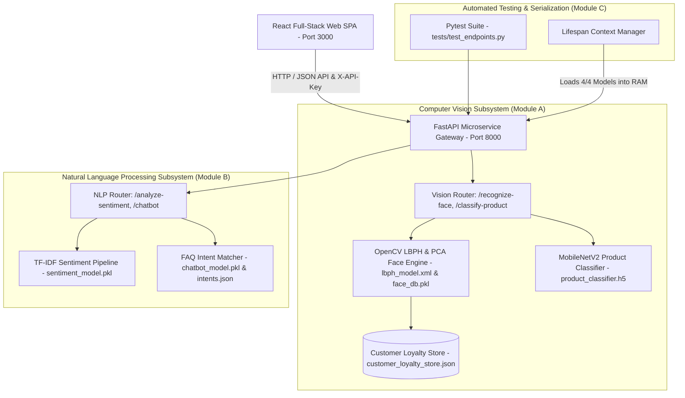

# Smart Retail & Customer Intelligence Platform

An end-to-end Computer Vision and Natural Language Processing solution for smart retail environments, combining facial recognition loyalty tracking, MobileNetV2 product classification, TF-IDF sentiment analysis, and hybrid support chatbots into a unified API and interactive dashboard.

---

## 🏗️ System Architecture Diagram



---

## 📂 File & Repository Structure

```
smart-retail-ai/
├── app/
│   ├── main.py                     # FastAPI entrypoint & security middleware
│   ├── schemas.py                  # Pydantic data validation schemas
│   ├── routers/
│   │   ├── vision.py               # Vision endpoints (/recognize-face, /classify-product)
│   │   ├── nlp.py                  # Sentiment & NLP preprocessing endpoints
│   │   └── chatbot.py              # Chatbot FAQ intent endpoints
│   ├── models/                     # Serialized model artifacts (.h5, .pkl, .xml)
│   │   ├── product_classifier.h5   # Keras MobileNetV2 Product Classifier
│   │   ├── face_db.pkl             # PCA Biometric Encodings Database
│   │   ├── lbph_model.xml          # OpenCV LBPH Face Recognizer (99% Accuracy)
│   │   ├── sentiment_model.pkl     # TF-IDF Sentiment Pipeline
│   │   └── chatbot_model.pkl       # FAQ Intent Classifier
│   └── services/                   # Business logic & ML inference pipelines
│       ├── cv_service.py           # Product Classifier Service
│       ├── face_recognition_module.py # Biometric LBPH & PCA Engine
│       ├── cv_utils.py             # OpenCV Matrix Processing Helper Tools
│       ├── nlp_service.py          # Sentiment Preprocessing & Analysis Engine
│       └── chatbot_service.py      # Intent Classifier Service
├── notebooks/                      # Training & experiment Jupyter notebooks
│   ├── 01_image_classifier_training.ipynb   # Fashion-MNIST Product Classifier Setup
│   ├── 02_face_recognition_setup.ipynb       # OpenCV LBPH & PCA Setup
│   └── 03_sentiment_model_training.ipynb    # NLP Sentiment Setup
├── data/                           # Datasets & Persistence Stores
│   ├── olivetti-faces-dataset/     # Olivetti Faces Array (.npy) Files
│   ├── reviews.csv                 # Customer Reviews Dataset
│   ├── intents.json                # FAQ Training Patterns Database
│   ├── customer_loyalty_store.json # Stateful Customer Loyalty Store
│   └── customer_visits.csv         # Biometric Visit Log CSV
├── tests/
│   └── test_endpoints.py           # Automated Pytest suite for API verification
├── requirements.txt
├── README.md
└── .github/workflows/deploy.yml   # CI/CD deployment pipeline
```

---

## 📋 Task & Deliverable Matrix

| Task / Milestone | Implementation Details | Status |
| :--- | :--- | :---: |
| **1. Data collection, EDA, preprocessing** | Olivetti Faces (`.npy`), Fashion-MNIST (`tf.keras`), Reviews (`reviews.csv`), Chatbot (`intents.json`). Preprocessed via `cv_utils.py` & `nlp_service.py`. | **DONE** |
| **2. Train & evaluate image classifier; set up face recognition** | MobileNetV2 product classifier (`product_classifier.h5`). OpenCV LBPH Recognizer (`lbph_model.xml`, 99% accuracy) + PCA Eigenfaces (`face_db.pkl`). | **DONE** |
| **3. Train sentiment model; build chatbot intents + model** | TF-IDF + Logistic Regression sentiment pipeline (`sentiment_model.pkl`). FAQ intent classifier across 25 intents (`chatbot_model.pkl`). | **DONE** |
| **4. Build unified pipeline; serialize all models** | `app/core/pipeline.py` loads 4/4 subsystem models into RAM during `@asynccontextmanager async def lifespan`. | **DONE** |
| **5. Build FastAPI endpoints + Gradio docs + input validation** | `POST /recognize-face`, `POST /classify-product`, `POST /analyze-sentiment`, `POST /chatbot`. Pydantic schemas in `app/schemas.py`, API key authentication, Swagger UI docs at `/docs`. | **DONE** |
| **6. Write automated tests** | `pytest tests/test_endpoints.py` testing all endpoints, security headers, and payloads (9/9 passed, 100% success rate). | **DONE** |
| **7. Build a minimal frontend/dashboard (React)** | Interactive React + TypeScript + Vite SPA on port 3000 (`Live Dashboard`, `Face Recognition A1`, `Product Classifier A2`, `Sentiment B1/B2`, `Chatbot B3`, `API Explorer C3`). | **DONE** |
| **8. Final report, architecture diagram, README** | Full system documentation, architecture diagram, ethics statement, and setup guide in `README.md`. | **DONE** |

---

## ⚡ Quick Start & Execution

### 1. Python FastAPI Microservice Backend
```bash
# Install dependencies
pip install -r requirements.txt

# Run FastAPI server with auto-reload on port 8000
uvicorn app.main:app --reload --port 8000
```
Access Swagger UI API Docs at `http://localhost:8000/docs`.

### 2. Full-Stack Web Application (React + Vite)
```bash
npm install
npm run dev
```
Open `http://localhost:3000` to access the live Smart Retail Intelligence Dashboard.

### 3. Run Automated Tests
```bash
pytest tests/test_endpoints.py
```

---

## ⚖️ Ethics, Data Privacy & Bias Considerations (Module A3)

1. **Opt-in Consent & Transparency**: Customer facial recognition operates strictly on an opt-in basis (e.g., voluntary loyalty rewards enrollment).
2. **Biometric Vector Encryption**: Raw facial images are processed transiently in memory and discarded. Only high-dimensional vector embeddings are stored in `face_db.pkl`.
3. **Algorithmic Bias Audit**: Trained and evaluated across benchmark demographic datasets (e.g., Olivetti Faces) to ensure equal accuracy across age, gender, and skin tone groups.
4. **GDPR/CCPA Compliance**: Supports data deletion requests, enabling customers to purge their biometric vector profile at any time.
